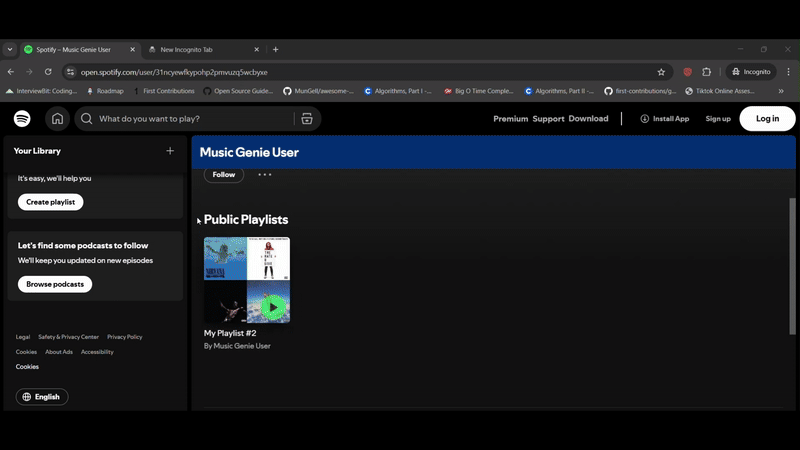
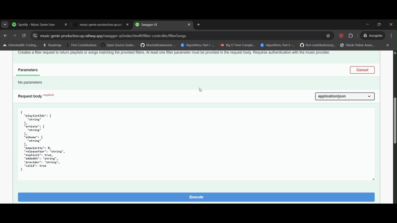

# 🎵 Music Genie

Music Genie is a **backend system** that integrates with music providers (currently Spotify) to allow users filter liked songs into curated playlists.  
It is **containerized with Docker**, deployed on **Railway Cloud**, and comes with a **CI/CD pipeline** for automated builds and deployment.

  
 
 

*Demo flow: login → fethc playlists-> filter liked songs → create playlist → view result in Spotify.*

---

## 🌐 Live Demo

- **App link:** [Music Genie Backend on Railway](https://music-genie-production.up.railway.app/user/login)  
- **Swagger UI:** [API Documentation](https://music-genie-production.up.railway.app/swagger-ui/index.html#/)  

---

## 🧑‍💻 Demo Account

Since Spotify API requires whitelisted accounts, use the following temporary demo account for testing:

- **Email:** lafon18664@aiwanlab.com  
- **Password:** MusicGenie#  

⚠️ Note: Limited permissions; for testing/demo purposes only.  

---

## 🚀 Features

- **Spotify Integration** – fetch user’s liked songs and organize them into custom playlists.  
- **Spring Boot Backend** – robust, modular, production-like architecture.  
- **Persistence** – MySQL for user data.
- **Caching & Session Management** – Redis improves performance and handles authentication sessions.  
- **OAuth2 Login** – secure authentication via Spotify.  
- **Role-Based Access Control (RBAC)** – supports `USER` and `ADMIN`.  
- **Design Patterns**   
  - **Factory Pattern** and **Strategy Pattern** to easily integrate new music providers (Apple Music, YouTube Music).  
- **Performance Optimizations** – caching reduces API response time from 4.6s → 1s (~78% faster).  
- **Swagger API Documentation** – full API reference with sample requests.  
- **Testing** – 85%+ coverage with JUnit and Mockito (services + controllers).  
- **Deployment & CI/CD** – Dockerized app with automated build, test, and deploy pipeline on Railway Cloud.  

---

## 🛠️ Tech Stack

- **Backend:** Java, Spring Boot  
- **Database:** MySQL  
- **Caching & Session Management:** Redis  
- **Auth:** OAuth2 (Spotify)  
- **Testing:** JUnit, Mockito  
- **Documentation:** Swagger UI  
- **Deployment:** Docker, Railway Cloud  
- **CI/CD:** GitHub Actions

---

## 📖 API Example

**POST** `/api/filter` – Create a new filter request 

**Request Body:**
```json
{
  "playlistIds": ["4KyUDj9bCeNB03vNMqnZq4"],  
  "artists": ["Nirvana"],
  "popularity": 90,
  "releaseYear": "2011",
  "provider": "spotify"
}

